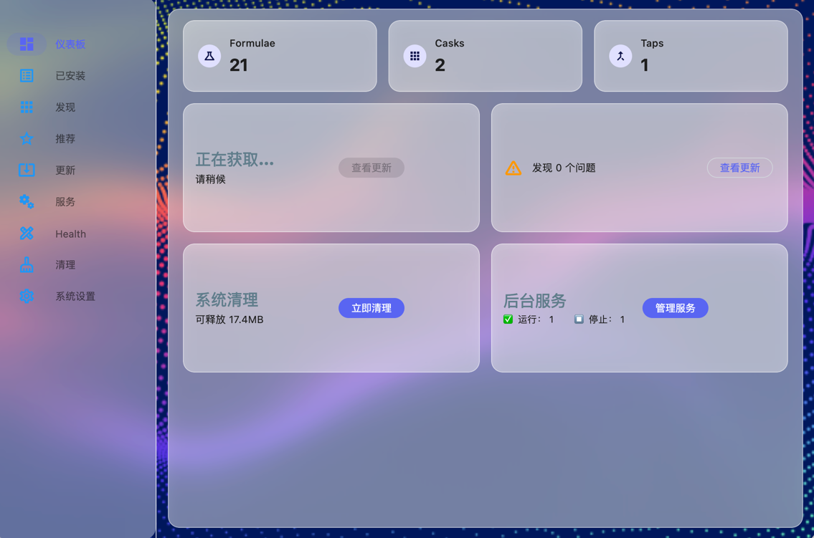
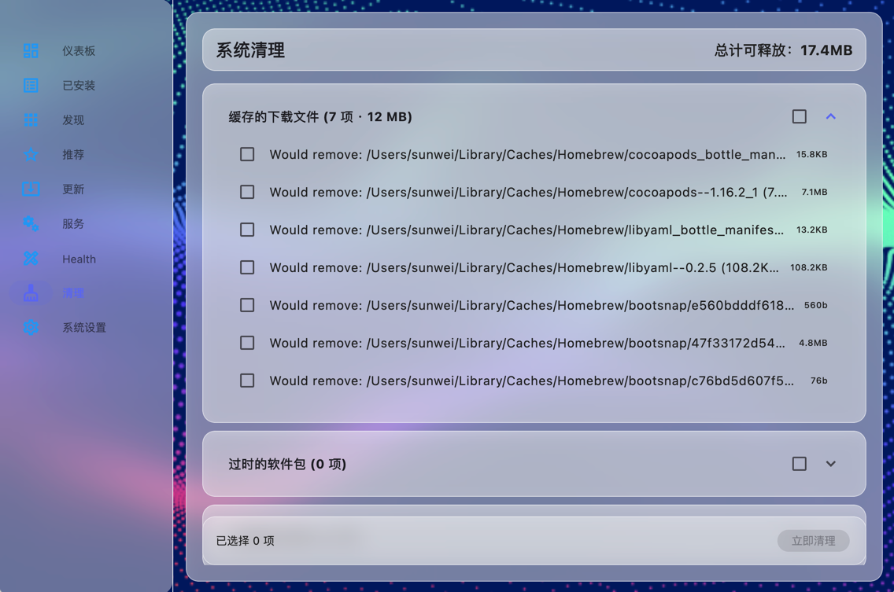
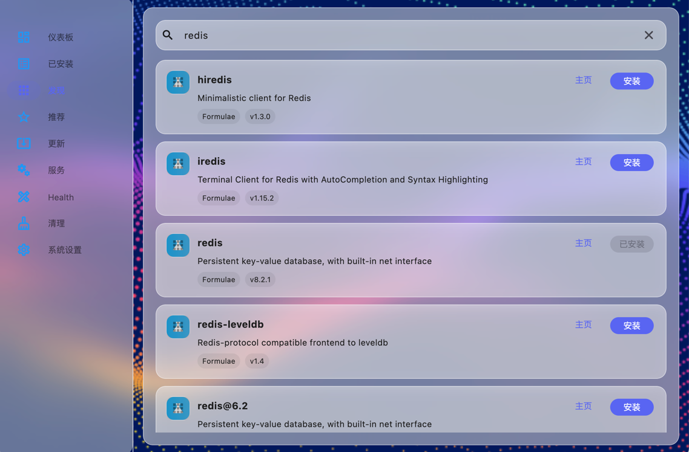
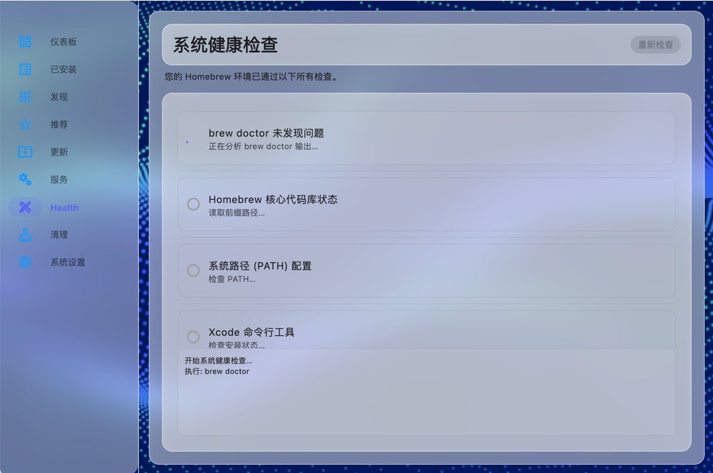
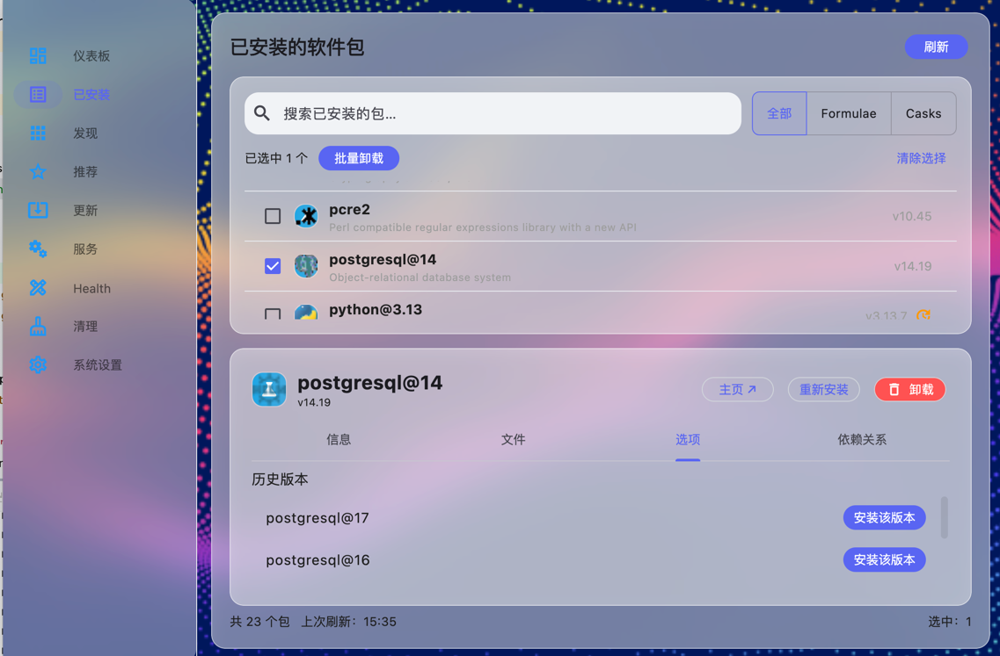
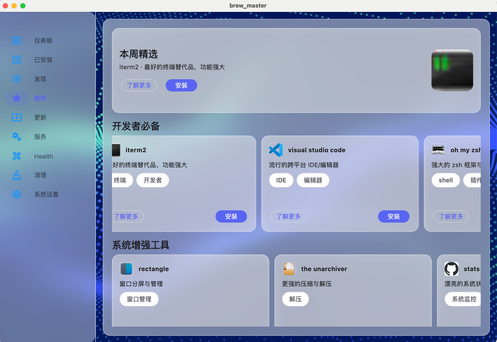
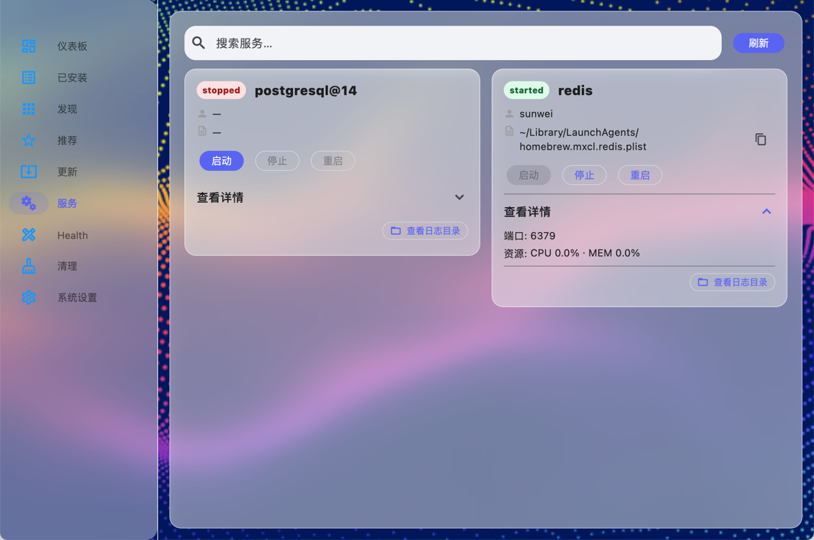
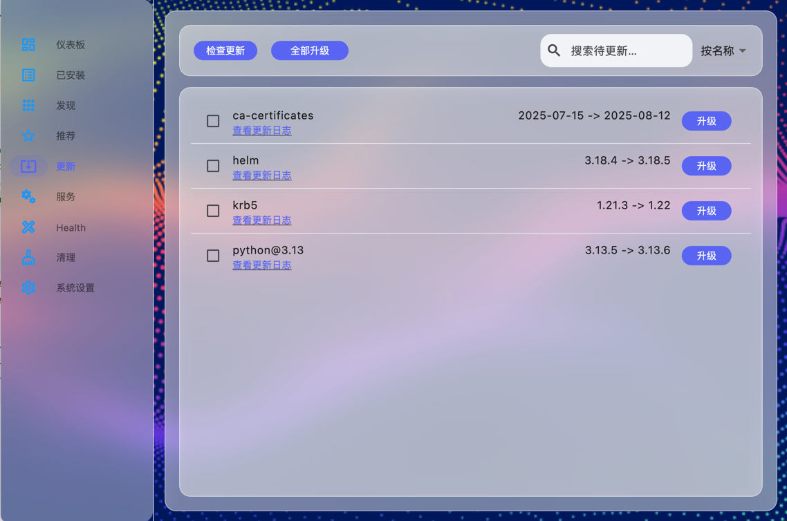

# BrewMaster

 







一款优雅、强大的 Homebrew 图形化客户端（Flutter Desktop）。

- 以桌面级体验管理 Homebrew：安装、卸载、更新、服务、清理、健康检查、发现与推荐
- 玻璃拟态（Glassmorphism）+ 统一主题体系，兼具美观与信息密度
- 实时命令输出与进度反馈，关键操作可视化且可追踪

> 建议在 macOS 上使用（已适配 Flutter 桌面端）。

---

## 下载与安装

- 直接下载： [BrewMaster-universal.dmg](dist/BrewMaster-universal.dmg)（约 21 MB，Apple Silicon 与 Intel 双架构）
- 系统要求：macOS 13+（建议），需已安装 Homebrew

安装步骤：
1. 双击打开 DMG
2. 将 BrewMaster 拖拽到「应用程序」
3. 若首次启动被阻止，右键图标选择「打开」即可

文件校验（可选）：
```bash
shasum -a 256 dist/BrewMaster-universal.dmg
# 期望值：
# f901294104010789e925b5a9a9239424fad4d734e97f8901c6963f1a6f993a6c
```

### 未安装 Homebrew？

- 官方安装命令：
```bash
/bin/bash -c "$(curl -fsSL https://raw.githubusercontent.com/Homebrew/install/HEAD/install.sh)"
```

- 安装完成后（初始化环境）：
  - Apple Silicon（M1/M2/M3）：
  ```bash
  echo 'eval "$(/opt/homebrew/bin/brew shellenv)"' >> ~/.zprofile
  eval "$(/opt/homebrew/bin/brew shellenv)"
  ```
  - Intel x86：
  ```bash
  echo 'eval "$(/usr/local/bin/brew shellenv)"' >> ~/.zprofile
  eval "$(/usr/local/bin/brew shellenv)"
  ```

- 验证安装：
```bash
brew --version
brew doctor
```

- 如提示缺少 Xcode Command Line Tools：
```bash
xcode-select --install
```

- 参考： [Homebrew 官网安装指南](https://brew.sh)

完成以上步骤后，重新打开 BrewMaster，确保 `brew` 已在 `PATH` 中即可正常使用。

---

## 预览

- 仪表盘（Dashboard）  
  
- 已安装（Installed）  
  
- 发现（Discover）与 推荐（Recommended）  
    
  
- 更新（Updates）  
  
- 服务（Services）  
  
- 系统健康（System Health）  
  
- 系统清理（System Cleanup）  
  

---

## 核心特性

- 安装管理
  - 列出 Formulae/Casks，详情页支持历史版本、文件列表、选项查看
  - 卸载/重装/Pin/Unpin，带确认与反馈
- 搜索与安装
  - 同步 `brew search`，结果卡片一键安装，实时日志
- 更新中心
  - 展示过期项、单个/批量/全部升级，进度条+ETA 估算，依赖影响提示，变更日志链接
- 服务管理
  - `brew services list` 可视化，Start/Stop/Restart，忙碌状态与结果反馈
- 仪表盘概览
  - 已安装统计、更新数、系统健康、可清理空间、服务状态，一目了然
- 系统清理
  - 按类别（缓存/旧版本/未链接等）展开选择，汇总已选容量，底部固定“立即清理”
- 系统健康
  - 逐项检查动画（待检查→进行中→结果），并带实时日志流
  - 包含 brew doctor、Prefix、PATH、Xcode CLT、缺失依赖等清单式结果
- 推荐页
  - 官方 Logo（基于 favicon）、卡片式横向滚动分类、顶部“本周精选”横幅
  - 统一“玻璃风格”轻量 Toast 提示（安装完成等）

---

## 架构与目录

- 入口与主题
  - `lib/main.dart`：应用入口、全局背景与 builder
  - `lib/app/app_theme.dart`、`lib/app/app_colors.dart`：主题与配色
- 核心服务与模型
  - `lib/core/services/brew_service.dart`：所有 `brew` 调用与容错（PTY、重试、文本回退解析）
  - `lib/core/models/`：`Package`、`OutdatedPackage`、`ServiceItem` 等
  - `lib/core/widgets/`：`FrostCard`、通用按钮/输入/区块等
- 功能模块
  - `lib/features/dashboard/`：仪表盘
  - `lib/features/packages/`：已安装列表与详情
  - `lib/features/search/`：发现与搜索
  - `lib/features/updates/`：更新管理
  - `lib/features/services/`：服务管理
  - `lib/features/health/`：系统健康检查
  - `lib/features/cleanup/`：系统清理
  - `lib/features/recommend/`：推荐页
  - `lib/features/home/home_view.dart`：左侧 `NavigationRail` + `IndexedStack` 主布局

---

## 桌面端特性与注意事项（macOS）

- 命令执行与权限
  - 本项目依赖 `dart:io` 调用系统 `brew`，需要在 macOS Debug 下关闭沙盒
  - `macos/Runner/DebugProfile.entitlements` 中已将 `com.apple.security.app-sandbox` 设为 `<false/>`
- 窗口与材质
  - `macos/Runner/MainFlutterWindow.swift`：最小窗口尺寸、窗口行为
- 视觉风格
  - `FrostCard` 通过 `BackdropFilter` + 半透明容器实现玻璃拟态

---

## 开发与运行

### 环境要求

- Flutter 3.22+（建议）并启用 macOS 桌面支持
- 系统已安装 Homebrew（`brew --version`）
- macOS 13+（建议）

### 本地启动

```bash
flutter pub get
flutter run -d macos
```

若首次启用桌面：

```bash
flutter config --enable-macos-desktop
```

### 构建发布

```bash
flutter build macos
```

---

## 常见问题与容错

- Homebrew 远端 API 异常
  - 若出现 `Cannot download non-corrupt https://formulae.brew.sh/api/formula.jws.json!`：
    - 程序会自动以 `HOMEBREW_NO_INSTALL_FROM_API=1`、`HOMEBREW_NO_GITHUB_API=1` 重试
    - `brew outdated` / `brew info` 失败时，启用纯文本回退解析，避免崩溃
- `brew doctor` 有 Warning 导致非 0 退出
  - 健康页使用 `allowNonZero` 并解析输出文本，不会中断
- 进度显示
  - macOS 使用 `script -q /dev/null -c` 启动 PTY，实时流输出（`brew install/upgrade`）

---

## 设计语言与交互亮点

- 统一玻璃材质（导航/卡片/提示）
- 高信息密度 + 合理留白（“呼吸感”）
- 实时日志、状态动画（健康检查、安装/升级）
- 响应式布局：`SliverGridDelegateWithMaxCrossAxisExtent` + `Wrap`/`LayoutBuilder`

---

## 路线图

- 推荐内容智能化：安装画像、热门趋势
- 历史版本管理增强：一键 `extract + install` 可视化
- 更多批量操作：Pin/Unpin、多选清理/升级
- 图标缓存与离线降级

---

## 贡献

欢迎提交 Issue / PR，一起把 BrewMaster 打磨成一款真正高效、优雅的 Homebrew GUI。

---

## 许可

GNU AFFERO GENERAL PUBLIC LICENSE Version 3, 19 November 2007
[LICENSE](LICENSE))
